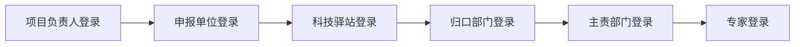

# 关于征集2025年度雄安新区本级科技攻关 项目（人工智能领域）的通知

| 字段 | 值 |
| --- | --- |
| infoId | POLICYFILE3639135484hdnvz |
| 发布时间 | 2025-09-10 |
| 发文单位 | 河北雄安新区工信科技数据局 |
| 文件级别 | 市级 |
| 发文文号 |  |
| 政策标签 | 科技创新 |
| 适用企业 |  |
| 附件数量 | 1 |

## 正文

各有关单位:

为深入贯彻落实习近平总书记关于高标准高质量建设雄安新区的重要指示精神，加快培育发展新质生产力，推动人工智能与雄安新区城市建设中创新场景深度融合，现公开征集2025年度雄安新区本级科技攻关项目（人工智能领域）。有关要求如下：

一、征集目的

围绕雄安新区高质量建设、高水平管理、高质量疏解发展中的紧迫性、前瞻性科技需求，吸引和集聚国内外优秀科研力量和高端人才开展科研工作，推动人工智能技术研发、场景落地与产业集聚，助力雄安打造具有全球影响力的人工智能创新发展高地。

二、征集要求

（一）范围要求

重点聚焦人工智能领域，围绕大模型、机器感知与机器人、自主可控芯片应用方向，加快突破人工智能领域关键核心技术。大模型方向着力突破高效训练、推理部署等关键技术，推动创新应用落地。机器感知与机器人方向重点围绕智能感知、灵巧操作、自主决策与人机共融等核心能力，提升机器人智能化水平与应用适应性。自主可控芯片应用方向聚力高性能高能效AI算力、空天信息、能源表计、智能交通等城市建设领域，构建自主开放的自主可控产业生态。鼓励科研攻关团队面向智能网联、AI算力等重点需求，开发高性能、低功耗、低成本的AI解决方案，以技术突破驱动产业升级。

（二）对象要求

1.在雄安新区范围内注册的企业、科研机构和高等院校等具有独立法人资格的单位，或根据非首都功能疏解安排部署，以非法人机构形式在新区落地的疏解单位。

2.单位管理规范，业务及财务制度健全，具有相应的科研能力和条件，运行管理规范，在新区范围内有固定办公场所并持续运营，有常驻工作人员。

3.项目负责人应具有高级专业技术职务（职称），具备领导和组织开展创新性研究的能力，科研信用记录良好。

（三）项目要求

1.项目单位具有满足项目正常实施所需的基本资金、基础和条件，有固定的场所，无知识产权纠纷。

2.项目投资总额和资金来源应明确，已获得财政经费支持的相关技术及研究内容，不得再重复申报。

3.项目需要有一定的研究基础，在2025年12月前启动，执行周期原则上不超过2年。

4.项目需具有明确的技术创新性和示范应用性，具有清晰、可量化的目标及考核指标。

5.企业作为申报单位须对项目经费进行配套，自筹经费与申请财政科技经费比例原则上不低于2:1。

6.各申报单位承担本次本级科技攻关项目数量原则上不超过2项（不含雄安新区“揭榜挂帅”科研课题、重大科技专项、软科学研究项目），鼓励联合各高校、科研院所等单位申报，开展协同创新，联合攻关技术难题。

三、支持方式及金额

每个支持项目给予资金支持原则上不超过300万元。形成的具有转化潜力的科技成果，可优先推荐新区相关产业基金进行投资孵化。

四、申报流程

1.申报单位根据申报通知的受理时间和条件等要求提交所有申报材料。

2.新区工信科技数据局组织相关部门对申报材料的规范性和齐备情况进行初审。符合条件的，予以受理；不符合条件的，一次性告知需要补充的全部内容。

3.受理工作结束后，新区工信科技数据局根据项目受理情况，分批次开展评审，根据评审结果确定拟支持项目。

4.新区工信科技数据局将拟支持项目名单在指定官方网站进行公示，公示期为5个工作日。

5.公示期满无异议的项目，新区工信科技数据局将按照相关程序办理立项、资金拨付及后期项目管理等工作。

五、提交要求

1.登陆雄安新区产业互联网平台-科技项目综合服务平台板块（https://techpro.xaiip.org.cn/webIndex），点击政策申报-申报指南-立即申报（具体登录及申报操作手册详见附件）。征集时间自2025年9月12日9时至2025年9月22日17时止，逾期不予受理。

六、联系方式

联系人：陈宇

联系电话：0312-5620800

七．注意事项

1.项目申报单位须无不良信用记录，对申报材料内容的真实性、合法性负责，如存在虚假填报等情况，项目视为无效。

2.雄安新区工信科技数据局未指定、授权或委托任何中介机构或个人从事科研项目申报的代理活动，代理机构或个人的行为与工信科技数据局无关。

附件：操作手册

河北雄安新区工信科技数据局

2025年9月10日

## 附件 1：项目申报阶段操作手册-申报单位和申报人.pdf

- 原始文件：`../pdfs/023_2025-09-10_项目申报阶段操作手册-申报单位和申报人.pdf`
- 来源 URL：https://api.xaiip.org.cn/files/view?url=group2/M00/01/9F/ChmtDGjBWymAXU-kAEY7_rqA1zg851.pdf
- 解析方式：`MinerU (cached)`

# 第一章 申报单位

# 1.1. 登录

（1）登录系统：https://techpro.xaiip.org.cn/webIndex，在系统首页找到【申报单位登录】按钮并点击，如图所示：

一系统登录

text_image

项目负责人登录
申报单位登录
科技驿站登录
归口部门登录
主责部门登录
专家登录

（2）进入登录页面。按要求输入账号、密码及验证码，点击【登录】进入系统， 如图所示：

text_image

雄安新区科技计划项目综合服务平台
申报单位登录
请输入用户名
该项为必填项
请输入密码
该项为必填项
验证码
1+
=
记住我
忘记密码?
完善信息后可在此登录
登录
政务网登录
手机登录
第一次登录在政务网登录

（3）第一次登录平台，需要点击【政务网登录】，进入雄安新区政务服务网登录页面。如果企业有政务服务网的法人账号和密码，直接登录，即可跳转回科技计划项目综合服务平台，如果企业没有在政务网注册登记，则需要先在政务服务网注册一下，才能登陆本平台。如图所示：

全国一体化在线政务服务平台

雄安新区政务服务网

text_image

世界眼光 国际标准
中国特色 高点定位
个人登录 法人登录
法人 经办人 数通雄安扫码登录
注册过的直接登录代码
请输入密码
登录
立即注册 没有注册过的需要先注册 记密码

（4）第一次登录后，需要企业完善信息，完善好信息点击【确定】，才能进入管理后台，如图所示：

text_image

雄安新区科技项目综合服务平台
请输入您要搜索的内容
首页
功能
完善单位信息
登录说明
登录说明
雄安新区科技计划项目综合服务平台是雄安新区科技项目的网上申报、管理的统一入口。申报单位须仔细阅读如下说明，只有申报单位确认遵守如下约定才能进行申报账号注册、项目申报。
根据《河北雄安新区科技计划项目暂行管理办法》《河北雄安新区科技项目（课题）经费暂行管理办法》相关要求:项目承担单位应当是登记、注册在雄安新区的独立法人单位，或根据非首都功能疏解安排部署，以非法人机构形式在新区落地的疏解单位。全国范围内的高等学校、科研院所、企业等可作为合作单位参与承担项目。
1、申报单位必须严格遵守国家有关信息保密的法律、法规，不能在本系统登录任何涉密信息。
2、申报单位在账号注册、项目申报报送过程中必须遵守国家有关网络使用、信息安全的法律规定。
3、申报单位须仔细阅读相关科技计划的管理文件、办法，确认本单位具备相关科技计划的项目申报资格。
点击同意进入下一步 → 同意 不同意
查看更多 >
2024-10-15
2023-12-16
2024-08-28
2024-03-27
2025-07-22
消息通知
项目申报说明
任务书填写说明
项目变更说明
验收管理说明
系统登录

text_image

完善单位信息
登录说明
特别提醒：
1、请选择正确的所属科技驿站，选择错误将会影响您的项目申报工作。在无法明确本单位所归属的科技驿站时，请先联系可能的科技驿站进行确认，再进行系统注册。
2、注册完成后，单位注册信息由上级部门进行审核，审核通过后才可进行登录、创建本单位的申报人用户、审核本单位申报项目等操作。
* 单位名称（与单位公章一致）
    请填写营业执照上面的单位全称，不能简称和省略，与营业执照不符将不能通过实名认证。
* 统一社会信用代码
    请填写营业执照上面的统一社会信用代码。
* 单位性质
    请选择
* 法定代表人
    请输入单位的法定代表人姓名。
* 法定代表人身份证号
    请输入单位的法定代表人身份证号，如身份证尾数是x，请填写小写的x。
* 法定代表人手机号
    请输入单位的法定代表人手机号码。
* 所属科技驿站
    请选择
    请选择公司实际办公地址所属驿站，你的账号审核以及将来项目的上报都与该部门有密切关系。
单位登录用户名
* 密码
    请输入单位登录用户名，此用户名为单位管理员登录用户名。
    请输入
    请为单位管理员设置登录密码，登录密码需包含大小写字母及数字，密码中必须含有!@#$*。且密码长度不可小于十位。
* 请勾选后进行下步操作 □ 同意授权改发局向依法成立的第三方机构查询或核实个人信息
上一步 下一步

text_image

雄安新区科技项目综合服务平台
登录说明
请输入您要搜索的内容
完善单位信息
登录说明
单位基本信息
* 实际办公地址 请输入
* 办公电话 请输入
* 技术人员数 请输入 人
* 开户名称 请输入
* 开户行行号 请输入
* 资产总额 请输入 万元
* 注册（纳税）地区 请输入
单位其他特征 □ 高新技术企业 □ 省重点实验室（工程技术研究中心） □ 国家级创新型（试点）企业
□ 省级创新型（试点）企业 □ 农业产业化龙头企业 □ 国家国际科技合作基地
□ 省国际科技合作基地 □ 省科学研究基地 □ 省级科普基地 □ 国家重点实验室（工程技术研究中心）
* 是否为省级以上高新技术企业 请选择
* 是否在省级以上高新区 请选择
* 是否有省级以上研发平台 请选择
* 注册资本 请输入 万元
* 是否为省级以上科技型中小企业 请选择
* 省级以上高新区 请选择
* 所属园区 请选择
* 时间 请选择

（5）进入系统后首页显示当前用户待办事项统计、政策文件等信息。如图所示：

text_image

雄安新区科技计划项目综合服务平台
首页 申报管理 系统管理
首页
申报待审核项目
任务书待审核项目
变更待审核项目
验收申请待审核项目
验收证书待审核项目
验验收项目
政策文件
请输入 搜索
申报项目
申报起止时间
申报剩余时间
浏览量
操作
已结束
2
申报指南
已结束
0
申报指南
已结束
5
申报指南
已结束
0
申报指南
2024年雄安新区第二批“维修结转”科研课题清单发布申报
2024.02.27-2024.04.05

（6）进入系统后首页显示当前用户待办事项及政策文件等信息。点击左上角系统名称或【门户网站】可回到门户页面。如图所示：

text_image

雄安新区科技计划项目综合服务平台
首页 申报管理 系统管理
门户网站
申报项目管理
申报书审核
申报项目浏览
首页 申报用户管理
点击可以回到门户网站首页
1
申报待审核项目
任务书待审核项目
变更待审核项目
验收申请待审核项目
验收证书待审核项目
验收项目
政策文件
请输入 搜索
申报项目
申报起止时间
申报剩余时间
浏览量
操作
雄安新区本级科技攻关项目（第二批）征集
2024-10-15-2024-11-05
已结束
4
雄安新区本级科技项目申报书批征集
2023-12-16-2024-01-04
已结束
1
申报指南
申报指南
申报指南
申报指南

# 1.2. 忘记密码

如果忘记了用户名或者密码可以在登录页面点击【忘记密码】按钮找回。输入管理员的手机号，验证成功后输入新的密码即可。 如图所示：

text_image

雄安新区科技计划项目综合服务平台
申报单位重置密码
□ 请输入手机号码
○ 请输入验证码 获取验证码
选项为必填项
请输入密码
密码长度为4到16位
确认密码
重置密码
返回

# 1.3. 用户管理

（1）管理员可以在系统管理——用户管理——申报用户管理菜单，对本单位的所有申报人用户进行维护。可以对用户进行增删改查，以及限制登录。（注意：申报用户必须为项目负责人，且必须进行实名，保障信息的真实性，要求年龄不超过60周岁，且同一个项目负责人在研项目不得超过2个）如图所示：

text_image

雄安新区科技计划项目综合服务平台
首页 申报管理 系统管理
首页 申报书审核 申报项目浏览 申报用户管理
登录名 请输入 姓名 请输入 手机 请输入手机号码
是否实名 是否实名 查询 重置
+ 新建 修改 删除 允许登录 禁止登录 重置密码
序号 登录名 姓名 手机号码 电话 身份证号 实名认证 所属单位 是否允许登录 修改时间 操作
224 是 2025-07-29 11:31:06 编辑 删除
231 是 2025-07-22 10:50:27 编辑 删除
共2条 10条/页 < 1 > 前往 1 页
Copyright ©2025 雄安新区科技计划项目综合服务平台

text_image

新增用户
1.请确保所填写的手机号为申报人本人所有，账号添加成功后，用户名及密码将以短信形式发送至申报人。
2.请确保所填写的姓名和身份证号码准确无误,注册成功后用户名、姓名、身份证号不可修改。
* 项目申报人用户名（登录
请输入项目申报人用户名
名）
* 真实姓名
请输入真实姓名
* 证件类型
请选择
*
* 证件号码：
如身份证尾数是x的请输入小写的x
* 办公电话
请输入办公电话
*
* 手机
请输入手机号码
确定 取消

（2）单位信息管理页面对本单位信息进行维护，如单位信息有变更，需要在申报政策之前进行变更并保存。如图所示：

text_image

雄安新区科技计划项目综合服务平台
首页 申报管理 系统管理
用户管理
申报用户管理
单位信息管理
单位基本信息变更
基本信息变更记录
首页 申报书审核 申报项目浏览 申报用户管理 单位信息管理 单位基本信息变更
友情提示:请如实填写单位信息,实名认证通过后。单位名称、统一信用代码、法定代表人姓名、法定代表人身份证号码信息,不可进行修改。
单位基本信息
* 单位名称(与单位公章一致):
* 统一社会信用代码:
* 法定代表人:
* 法定代表人身份证号:
单位详细信息
归口部门:
* 单位电话:
* 法定代表人手机号:
* 办公电话:
邮政编码:
* 职工总数: 20
* 技术人员数: 10 人 * 中高级技术人员数: 5 人

（3）单位基本信息变更页面，可变更单位基本信息及管理员信息。如单位信息有变更，需要在申报政策之前进行变更并保存。如图所示：

text_image

雄安新区科技计划项目综合服务平台
首页 申报管理 系统管理
用户管理
申报用户管理
单位信息管理
单位基本信息变更
基本信息变更记录
友情链接:请如实填写单位信息,实名认证通过后。单位名称、统一信用代码、法定代表人姓名、法定代表人身份证号码信息,不可进行修改。
单位基本信息
* 单位名称(与单位公章一致):
* 统一社会信用代码:
* 法定代表人:
* 法定代表人身份证号:
单位详细信息
* 单位性质: 其他
* 实际办公地址: 雄安新区
* 注册(纳税)地区: 雄安新区
* 注册资本: 100 万元
单位管理员信息
* 真实姓名:
* 身份证号码:

（4）单位基本信息变更记录，可查看变更的历史记录。如图所示：

text_image

雄安新区科技计划项目综合服务平台
首页 申报管理 系统管理
用户管理
申报用户管理
单位信息管理
单位基本信息变更
基本信息变更记录
首页 申报书审核 申报项目浏览 申报用户管理 单位信息管理 单位基本信息变更 基本信息变更记录
变更前内容: 变更后内容: 查询 重置
变更前信息 变更后信息 变更类型
暂无数据
共0条 10条/页 < 1 > 前往 1 页
Copyright ©2025 雄安新区科技计划项目综合服务平台

# 1.4. 申报书审核

（1）进入系统后在申报项目管理下的申报项目审核页面可以看到该单位下的所有用户已 经提交的申报书，如图所示：

text_image

雄安新区科技计划项目综合服务平台
首页 申报管理 系统管理
门户网站
申报项目管理
申报书审核
申报项目浏览
专项名称: 项目名称: 政策名称: 项目负责人: 单位名称: 指南代码:
请输入
主责部门: 年度:
请选择 选择年份 查询 重置
审核 批量审核通过 导出项目列表
申报人已提交: 8项, 专项总经费: 804万元, 待审核: 1项, 审核通过: 5项, 审核不通过: 0项, 退回: 2项
序号 状态 项目编码 项目名称 操作 单位名称 负责人 申
1 申报人提交单位待审核 0101011 测试项目 申报书 下载PDF
附件 盖章页
审核记录
共1条 10条/页 < 1 > 前往 1 页
Copyright ©2025 雄安新区科技计划项目综合服务平台

（2）在列表操作列可以对项目进行查看、预览、下载。如图所示：

text_image

雄安新区科技计划项目综合服务平台
首页
申报管理
门户网站
申报项目管理
申报书审核
申报项目浏览
申报书审核
专项名称:
项目名称:
政策名称:
项目负责人:
单位名称:
指南代码:
请输入
主责部门:
年度:
请选择
选择年份
查询
重置
审核
批量审核通过
导出项目列表
申报人已提交: 13项, 专项总经费: 610万元, 待审核: 1项, 审核通过: 8项, 审核不通过: 1项, 退回: 3项
状态
项目编码
项目名称
政策名称
课题名称
操作
单位名
单位通过归口待审
0101007
2222
查看/下载申报书.pdf文件、盖章页
附件, 查看审核记录
查看每个审核节点最终结果
查看申报书所有内容
共1条 10条/页
下载PDF
附件 盖章页
审核记录
Copyright ©2025 雄安新区科技计划项目综合服务平台

（3）选择项目后，点击【审核】按钮可对该条项目审核。选择【通过】，则进入下一环节审核，点击【退回】，则退回到申报人进行修改，选择【不通过】则结束流程，无法继续申报。如图所示：

text_image

雄安新区科技计划项目综合服务平台
首页 申报管理 系统管理
门户网站
申报项目管理
申报书审核
申报项目浏览
首页 申报书审核
专项名称: 项目名称: 政策名称: 项目负责人: 单位名称: 指南代码:
请输入
主责部门: 年度:
请选择 选择年份 查询 重置
审核 批量审核通过 导出项目列表
申报人已提交: 8项, 专项总经费: 804万元, 待审核: 1项, 审核通过: 5项, 审核不通过: 0项, 退回: 2项
序号 状态 项目编码 项目名称 操作 单位名称 负责人 申
1 申报人提交单位待审核 0101011 测试项目 申报书 下载PDF
附件 盖章页
审核记录
共1条 10条/页 < 1 > 前往 1 页
Copyright ©2025 雄安新区科技计划项目综合服务平台

text_image

审核
提示：全部项目必须进行审核，项目最终审核状态必须为“通过”或者“不通过”。
* 审核状态 ○ 通过 ○ 退回 ○ 不通过
* 审核意见 请输入
查看审核意见 取消 确定

# 1.5. 申报项目浏览

（1）申报项目浏览页面，可查看本单位所有申报人申报的项目的状态及基本信息。如图所示：

text_image

雄安新区科技计划项目综合服务平台
首页 申报管理 系统管理
门户网站
申报项目管理
申报书审核
申报项目浏览
专项名称: 项目名称: 政策名称: 项目负责人/项目组成员: 单位名称: 指南代码:
请输入
归口部门: 主责部门: 审核状态: 年度: 申请经费额度区间:
请选择 请选择 请选择 选择年份
查询 重置
导出项目列表
序号 项目状态 项目编码 项目名称 操作 单位名称 负责人 申报政
1 申报人提交单位待审核 测试项目 申报书 下载PDF
附件 盖章页
审核记录
2 单位通过科技驿站待审 申报书 下载PDF
附件 盖章页
审核记录

（2）点击列表上方的【导出】按钮可以导出当前页面的所有项目的 excel 文档， 如图所示：

text_image

雄安新区科技计划项目综合服务平台
首页 申报管理 系统管理
门户网站
申报项目管理
申报书审核
申报项目浏览
专项名称: 项目名称: 政策名称: 项目负责人/项目组成员: 单位名称: 指南代码:
请输入
归口部门: 主责部门: 审核状态: 年度: 申请经费额度区间:
请选择 请选择 请选择 选择年份
查询 重置
导出项目列表
序号 项目状态 项目编码 项目名称 操作 单位名称 负责人 申报政
1 申报人提交单位待审核 测试项目 申报书下载PDF
附件 盖章页
审核记录
2 单位通过科技驿站待审 5555 申报书下载PDF
附件 盖章页
审核记录
12345

（3）点击【项目状态】显示各个审核环节的最终审核状态，点击【项目名称】，显示用户填报的申报书详情，如图：

text_image

雄安新区科技计划项目综合服务平台
首页
申报管理
系统管理
门户网站
申报项目管理
申报书审核
申报项目浏览
首页
申报项目浏览
专项名称:
请输入
项目名称:
政策名称:
项目负责人/项目组成员:
单位名称:
指南代码:
归口部门:
请选择
主责部门:
请选择
审核状态:
请选择
年度:
选择年份
申请经费额度区间:
最小值
最大值
请选择
预复审结果:
请选择
复审结果:
请选择
查询
重置
隐藏搜索
导出项目列表
点击显示各个审核环节最终审核状态
点击显示申报书详细内容
序号
项目状态 ①
项目编码
项目名称 ①
1
归口通过主责待审
0101013
关于机器人在农业方面的研
究与应用
2
单位通过科技驿站待审
0101012
测测测测测测
操作 ①
单位名称
负责人
申报书下载PDF
附件盖章页
审核记录
申报书下载PDF
附件盖章页
审核记录

text_image

雄安新区科技计划项目综合服务平台
首页
申报管理
系统管理
门户网站
超
申报项目管理
申报书审核
申报项目浏览
详情
个人提交
承担单位
科技驿站
归口部门
主责单位
提交状态
单位审核
科技驿站审核
归口审核
主责单位审核
状态	提交	状态	通过	状态	通过	状态	通过	状态
负责人	12345	意见	查看	意见	查看	意见	查看	意见	查看
时间	2025-08-05 15:59	时间	2025-08-05 16:01	时间	2025-08-05 16:02	时间	2025-08-05 16:39	时间	2025-08-05 16:39
关闭
负责人
1	归口通过主责待审	0101013	关于机器人在农业方面的研
究与应用	○ 申报书	↓ 下载PDF
	● 附件	○ 盖章页
	□ 审核记录
2	单位通过科技驿站待审	0101012	测测测测测	○ 申报书	↓ 下载PDF
	● 附件	○ 盖章页
	□ 审核记录

text_image

雄安新区科技计划项目综合服务平台
首页 申报管理 系统管理
门户网站
申报项目管理
申报书审核
申报项目浏览
申报书填报预览
填写须知与说明 项目基本信息表 1项目意义与必要性 2研究目标与内容 3申报单位研究基础 4进度安排 5项目预算 6项目组织实施、保障措施及风险分析 >
一、填写说明
1. 项目申报书分为“项目意义与必要性”、“研究目标及内容”、“申报单位研究基础”、“进度安排”、“经费预算”、“项目组织实施、保障措施及风险分析”、“研究团队”和“所要求的附件”八个部分。申报书的内容将作为项目评审、以及签订任务合同书的重要依据，申报书的各项填报内容须实事求是、准确完整、层次清晰。
2. 请申报单位认真阅读申报通知，所申报的项目研究内容须符合通知的要求。
3. 项目名称应清晰、准确反映研究内容，项目名称不宜宽泛。
4. 申报书标题统一用黑体四号字，申报书正文部分统一用宋体小四号字填写。正文（包括标题）行距为1.5倍。凡不填写的内容，请用“无”表示。
5. 外来语要同时用原文和中文表达，第一次出现的缩略词，须注明全称。
6. 申报书中的单位名称，请填写全称，并与单位公章一致。
二、申报说明
申报单位对申报材料的真实性、完整性负责。
请申报单位审核、确认申报材料后提交。

（4）点击操作列表中的【申报书】，可在线查看申报书PDF版本，点击【下载PDF】可以下载PDF版申报书，如图：

text_image

雄安新区科技计划项目综合服务平台
首页
申报管理
系统管理
门户网站
申报项目管理
申报书审核
申报项目浏览
首页
申报项目浏览
申报书填报预览
专项名称:
项目名称:
政策名称:
项目负责人/项目组成员:
单位名称:
指南代码:
请输入
归口部门:
主责部门:
审核状态:
年度:
申请经费额度区间:
专审结果:
请选择
请选择
请选择
选择年份
最小值
最大值
请选择
预复审结果:
复审结果:
请选择
请选择
查询
重置
隐藏搜索
导出项目列表
序号	项目状态	项目编码	项目名称	操作	单位名称	负责人
1	归口通过主责待审	0101013	关于机器人在农业方面的研
究与应用	下载PDF
2	单位通过科技驿站待审	0101012	测测测测测	下载PDF
	附件	盖章页
	审核记录
	申报书
	附件
	审核记录
	下载PDF
	盖章页

text_image

雄安新区科技项目申报书
项目名称：
申报单位：
（公章）
项目负责人：
实施周期：
雄安新区改革发展局制

（5）点击操作列表中的【附件】【盖章页】可以查看、下载申报书中上传的附件和盖章页，如图：

text_image

盖章件
名称	上传文件	操作
雄安新区本级科技项目申报诚信承诺书（申请人部分）
查看 下载
雄安新区本级科技项目申报诚信承诺书（申报单位部分）
查看 下载
申报书封面	查看 下载
取消

text_image

附件
名称	上传文件	操作
联合申报协议	查看 下载
财务审计报告	查看 下载
技术就绪度自评表	查看 下载
其它	查看 下载
取消

（6）点击操作列表中的【审核记录】可以申报书所有审核记录的细节，如图：

text_image

详情
项目名称	类型	提交人/审核人	审核时间	审核意见
5月12日测试用申报项目	提交状态		2025-05-12 16:16
5月12日测试用申报项目	单位审核		2025-05-12 18:33
5月12日测试用申报项目	科技驿站审核		2025-05-12 18:51
5月12日测试用申报项目	归口审核		2025-05-12 19:11
5月12日测试用申报项目	主责单位审核		2025-05-12 19:11
关闭

（7）【申报项目浏览】列表页划到最后面，会有专家评审结果的展示，点击【查看】可以查看专家评审每个环节的评审结果和最终评审意见。如图所示：

text_image

雄安新区科技计划项目综合服务平台
首页 申报管理 系统管理
门户网站
申报项目管理
申报书审核
申报项目浏览
首页 申报项目浏览 申报书填报预览
专项名称: 项目名称: 政策名称: 项目负责人/项目组成员: 单位名称: 指南代码:
请输入
归口部门: 主责部门: 审核状态: 年度: 申请经费额度区间: 专审结果:
请选择 请选择 请选择 选择年份 最小值 - 最大值 请选择
预复审结果: 复审结果:
请选择 请选择 查询 重置
隐藏搜索 导出项目列表
指南代码 申请经费/万元 归口部门 主责部门 年度 专审结果 预复审结果 复审结果 项目评审结论
100 2025
100 2025 点击可查看最终评审结论 查看
详情
专审结论: ○通过 ○不通过
预复审结论: ○通过 ○不通过
复审结论: ○建议立项 ○建议不立项
评论时间:
意见: 请输入
取消

# 1.6. 个人信息

用户可以在右上角用户姓名下的个人中心菜单查看自己的信息，也可以修改密码。如图所示：

text_image

雄安新区科技计划项目综合服务平台
首页 申报管理 系统管理
门户网站
用户管理
申报用户管理 单位信息管理 单位基本信息变更 单位基本信息变更记录
变更前内容: 变更后内容: 查询 重置
个人中心
锁定屏幕
退出系统
变更前信息 变更后信息 变更类型
暂无数据
共0条 10条/页 < 1 > 前往 1 页
Copyright ©2025 雄安新区科技计划项目综合服务平台

text_image

雄安新区科技计划项目综合服务平台
首页 申报管理 系统管理
用户管理
申报用户管理
单位信息管理
单位基本信息变更
基本信息变更记录
个人信息
用户账号
姓名
联系方式
用户邮箱
所属单位
所属角色 申报单位
归口管理部门
创建日期 2025-06-25 15:55:40
基本信息
修改密码
* 旧密码
* 新密码
* 确认密码
保存 重置

# 1.7. 消息中心

（1）用户可以在右上角消息图标点击查看自己的消息通知，点击查看全部，能看到所有消息记录。如图所示：

text_image

雄安新区科技计划项目综合服务平台
首页
申报管理
系统管理
门户网站
首页
申报书审核
申报项目浏览
申报用户管理
单位信息管理
单位基本信息变更
基本信息变更记录
我的站内信
1
申报待审核项目
任务书待审核项目
验收申请待审核项目
验收证书待审核项目
政策文件
系统：你解答“项目 相关 申报材料，” 2025-07-29 13:55:19
2025-07-25 15:43:00
2025-07-25 10:41:07
系统： 请输入 225-8 口能
查看全部
申报起止时间
申报剩余时间
2025-07-28-2025-08-31
3
申报指南
2023-12-16-2024-01-05
0
申报指南
2024年雄安新区第一批“超级链接”构建课题清单
2024-08-28-2024-09-07
已结束

text_image

雄安新区科技计划项目综合服务平台
首页 申报管理 系统管理
首页 申报书审核 申报项目浏览 申报用户管理 单位信息管理 单位基本信息变更 基本信息变更记录 个人中心 我的站内信
【站内信配置】文档地址：https://doc.iocoder.cn/notify/
是否已读 请选择状态 发送时间 开始日期 结束日期 搜索 重置 标记已读 全部已读
发送人 发送时间 类型 消息内容 是否已读 阅读时间 操作
系统 2025-07-29 13:55:19 您好！申报人 12… 否
系统 2025-07-25 15:43:00 您好！申报人 12… 否
系统 2025-07-25 10:41:07 您好！申报人 12… 否
系统 2025-07-22 16:14:25 您好！申报人 12… 否
系统 2025-07-22 15:58:52 您好！申报人 12… 否
系统 2025-07-22 14:34:21 您好！申报人 12… 否
系统 2025-07-22 14:02:54 您好！申报人 12… 否
系统 2025-07-01 18:02:12 您好！申报人 12… 是 2025-07-02 11:00:32
操作
已读
已读
已读
已读
已读
已读
已读
详情
共 8 条 10条/页 < 1 > 前往 1 页

点击消息列表中操作的按钮，即可查看消息内容，如果是审核信息，还可以直接跳转到申报项目列表，查看项目详情。

text_image

消息详情
发送人	系统
发送时间	2025-07-07 17:34:31
消息类型
是否已读	否
内容
查看项目

# 第二章 项目申报人用户

# 2.1. 登录

（1）在系统首页找到【项目负责人登录】按钮并点击，如图所示：

flowchart

（2）进入登录页面。按要求输入账号、密码及验证码，点击【登录】进入系统，如申报人没有账号，需要申报企业登录系统，给申报人先新增账号。 如图所示：

text_image

雄安新区科技计划项目综合服务平台
项目申报人登录
请输入用户名
该项为必填项
请输入密码
该项为必填项
验证码
记住我
忘记密码？
登录
手机登录

（3）进入系统后首页显示当前用户待办事项及政策文件等信息。点击左上角系统名称或【门户网站】可回到门户页面。如图所示：

text_image

雄安新区科技计划项目综合服务平台
首页 项目申报
首页
点击回到门户网站
5
申报人待提交项目
政策文件
请输入
搜索
申报项目
申报起止时间
申报剩余时间
浏览量
操作
2024-10-15~2024-11-05
已结束
2
申报指南
2023-12-16~2024-01-04
已结束
0
申报指南
2024-08-28~2024-09-07
已结束
5
申报指南
2024-03-27~2024-04-05
已结束
0
申报指南
共 4 条 10 条/页
前往 1 页

# 2.2. 忘记密码

如果忘记了用户名或者密码可以在登录页面点击【忘记密码】按钮找回。输入您的手机号获取验证码，填写新的密码，验证成功后即可用新密码登录。如图所示：

text_image

雄安新区科技计划项目综合服务平台
项目申报人登录
请输入用户名
该项为必填项
请输入密码
该项为必填项
验证码
记住我
忘记密码？
登录
手机登录
火狐主页
雄安新区科技计划项目综合服务
雄安新区政务服务网
雄安新区科技计划项目综合服务
雄安新区科技计划项目综合服务
techpro.xaiip.org.cn/login
Gmail
翻译
火狐主页
常用设计网站
产品
雄安新区科技计划项目综合服务平台
项目申报人重置密码
请输入手机号码
请输入验证码
获取验证码
该项为必填项
请输入密码
密码长度为4到16位
确认密码
重置密码
返回

# 2.3.申报人填写申报书

（1）用户登录后可在管理后台首页看到自己申报待提交的申报书数量，以及平台发布的所有申报政策列表，选择想要申报的项目点击【立即申报】，填写弹窗内申报项目基本信息，也可以在门户首页进行申报，如图所示：

text_image

雄安新区科技计划项目综合服务平台
首页
项目申报
门户网站
首页
5
申报人待提交项目
政策文件
请输入
搜索
申报项目	申报起止时间	申报剩余时间	浏览量	操作
雄安新区本级科技攻关项目（第二批）征集	2024-10-15~2024-11-05	已结束	2	申报指南
雄安新区本级科技项目申报书首批征集	2023-12-16~2024-01-04	已结束	0	申报指南
2024年雄安新区第二批“揭榜挂帅”科研课题榜单	2024-08-28~2024-09-07	已结束	5	申报指南
2024年雄安新区第一批“揭榜挂帅”科研课题榜单发布申报	2024-03-27~2024-04-05	已结束	0	申报指南
雄安新区2025年揭榜挂帅第一批	2025-07-22~2025-08-25	30	2	立即申报	申报指南
共 5 条	10 条/页	<	1 >	前往	1	页

text_image

首页
政策申报
管理办法
下载专区
常见问题
在线服务
项目公示
I 政策申报
专项计划
全部
“揭榜挂帅”科研课题
雄安新区本级科技攻关项目
重大科技专项
软科学研究项目
仅显示可申报的项目
请输入关键词
搜索
申报项目
申报起止时间
申报剩余时间
浏览量
操作
雄安新区本级科技攻关项目（第二批）征集
2024-10-15~2024-11-05
已结束
2
申报指南
雄安新区本级科技项目申报书首批征集
2023-12-16~2024-01-04
已结束
0
申报指南
2024年雄安新区第二批“揭榜挂帅”科研课题榜单
2024-08-28~2024-09-07
已结束
5
申报指南
2024年雄安新区第一批“揭榜挂帅”科研课题榜单发布申报
2024-03-27~2024-04-05
已结束
0
申报指南
雄安新区2025年揭榜挂帅第一批
2025-07-22~2025-08-25
30
2
立即申报
申报指南
共 5 条 10 条/页 < 1 > 前往 1 页

text_image

申报项目
申报政策
* 专项计划
* 科研课题 请选择
指南代码
* 项目名称 请输入
承担单位
项目负责人
所属科技驿站
归口管理部门 请输入
主责部门
* 预计起止年月 0 开始日期 至 结束日期
填报日期

（2）申报项目基本信息弹窗填写完成保存后，系统会自动跳转到项目申报页面，页面中会显示刚才用户申报的项目，在需要申报的项目操作上点击【编辑】按钮可对申报书进行修改、编辑。

如果有填写错误或者误操作可以点击【删除】按钮将该条项目删除。如图所示：

text_image

雄安新区科技计划项目综合服务平台
首页
项目申报
项目名称 请输入
申报政策 请输入
查询
重置
友情提示：以下项目列表显示未提交的项目，已提交的项目请点击左侧的“申报书管理”菜单，进行查看。
点击编辑进入申报书编辑页面
项目名称 操作 单位名称 负责人 申报政策 专项名称 指南代码 归
编辑
删除
“揭榜挂帅”科研课题 安
编辑
删除
雄安新区本级科技攻关项目 容
共2条 10条/页 < 1 > 前往 1 页
点击删除，可以删掉此申报项目
Copyright ©2025 雄安新区科技计划项目综合服务平台

（3）点击【编辑】进入项目申报书填写页面后，按照要求依次填写所有页面的信息。确认无误后在最后一页进行校验与合成，生成PDF版本的申报书。如图所示：

填写须知与说明 项目基本信息表 1项目意义与必要性 2研究目标与内容 3申报单位研究基础 4进度安排 5项目预算 6项目组织实施、保障措施及风险分析 7研究团队 8附

# 项目信息

<table><tr><td>*项目名称</td><td colspan="2"></td><td>*项目领域</td><td>请选择</td><td></td></tr><tr><td>项目编码</td><td colspan="2"></td><td>*经费总预算</td><td>请输入经费总预算</td><td>万元</td></tr><tr><td>中财政资金</td><td>请输入其中财政资金</td><td>万元</td><td>*其他渠道获得资金</td><td>请输入其他渠道获得资金</td><td>万元</td></tr><tr><td>目起始时间</td><td colspan="2">2025年07月</td><td>*项目结束时间</td><td colspan="2">2025年08月</td></tr><tr><td>*实施周期</td><td>请输入实施周期</td><td>月</td><td></td><td></td><td></td></tr></table>

# 申报单位

text_image

单位名称
单位公章名称必须与单位名称一致
单位性质 请选择
织机构代码
组织机构代码指企事业单位国家标准代码，单位若已三证合一请填写单位统一社会信用代码。不组织机构代码的单位请写“00000000”。
单位法定代表人姓名
单位主管部门 请输入申报单位单位主管部门

text_image

雄安新区科技计划项目综合服务平台
首页
项目申报
申报项目管理
项目申报
申报项目管理
首页
项目申报
申报书填写
1项目意义与必要性
2研究目标与内容
3申报单位研究基础
4进度安排
5项目预算
6项目组织实施、保障措施及风险分析
7研究团队
8附件
盖章件
整体校验与合成
说明
前面步骤的信息填写完整以后，在最后环节进行校验与合成，系统将自动把之前所有的材料汇总生成申报书全文。
校验与合成
合成文件：
合成时间：
Copyright ©2025 雄安新区科技计划项目综合服务平台

text_image

1项目意义与必要性 2研究目标与内容 3申报单位研究基础 4进度安排 5项目预算 6项目组织实施、保障措施及风险分析 7研究团队 8附件 盖章件 整体校验与合成
说明
前面步骤的信息填写完整以后，在最后环节进行校验与合成，系统将自动把之前所有的材料汇总生成申报书全文。
校验与合成
合成文件：雄安新区本级科技项目申报书.pdf 下载预览
合成时间：2025年07月25日 10:29
校验合成成功，这里会有一个合成文件，可以下载和预览

（4）校验合成确定申报书没问题后，回到项目申报列表页，点击【提交】即发起申报流程，提交后的申报书不可以修改，如需修改必须让单位、科技驿站、归口部门、主责部门审核时【退回】才能修改，如图所示：

text_image

雄安新区科技计划项目综合服务平台
首页
项目申报
申报书填写
申报项目管理
申报书填写 (2)
项目名称
请输入
申报政策
请输入
查询
重置
友情提示：以下项目列表显示未提交的项目。已提交的项目请点击左侧的“申报书管理”菜单，进行查看。
项目名称
操作
单位名称
负责人
申报政策
专项名称
指南代码
归
编辑
提交
删除
校验合成成功的申报书，这里会有一个提交按钮，点击提交，发起申报流程
共 2 条 10 条/页
前往 1 页
Copyright ©2025 雄安新区科技计划项目综合服务平台

（5）提交之后的项目申报书，可以在【申报项目管理】页面进行查看审核进度和结果，如果被退回修改，可以在【申报项目管理】页面，点击查看【审核记录】，看一下退回原因，然后在【项目申报】页面进行编辑修改，重新提交即可。如图所示：

text_image

雄安新区科技计划项目综合服务平台
首页
项目申报
项目名称:
专项名称:
参与人:
年度 选择年份
申报项目管理
项目申报
申报项目管理
查询
重置
1.项目被退回后，申报人点击左侧菜单中的【项目申报】，选择被退回的项目，点击【编辑】，按照要求修改完成申报书后，重新校验合成后，再提交单位审核
2.申报人提交申报书后，不允许修改，只有单位、科技驿站、归口部门、主责部门退回后才可修改。
序号
项目状态
1
项目编码
项目名称
1
操作
1
单位名称
负责人
查看退回原因
查看申报书
盖章页
附件
下载PDF
审核记录
1
单位通过科技驿站待审
查看审核状态
主责通过专家评审待审
查看申报书
盖章页
附件
下载PDF
审核记录
2
主责通过专家评审待审
查看申报书
盖章页
附件
下载PDF
审核记录
3
归口通过主责待审
查看申报书
盖章页
附件
下载PDF
4
审核记录
查看申报书
盖章页
附件
下载PDF
审核记录
4
审核记录
审核记录
审核记录
审核记录
审核记录
审核记录
审核记录
审核记录
审核记录
审核记录
审核记录
审核记录
审核记录
审核记录
审核记录
审核记录
审核记录
审核记录
审核记录
审核记录
审核记录
审核记录
审核记录
审核记录
审核记录
审核记录
审核记录
审核记录
审核记录
审核记录
审核记录
审核记录
审核记录
审核记录

1 点击【项目状态】显示各个审核环节的最终审核状态，点击【项目名称】，

显示用户填报的申报书详情，如图：

text_image

雄安新区科技计划项目综合服务平台
首页
项目申报
门户网站
项目名称:
专项名称:
参与人:
年度 选择年份
查询 重置
1.项目被退回后,申报人点击左侧菜单中的【项目申报】,选择被退回的项目,点击【编辑】,按照要求修改完成申报书后,重新校验合成后,再提交单位审核
2.申报人提交申报书后,不允许修改,只有单位、科技驿站、归口部门、主责部门退回后才可修改。
序号	项目状态	项目编码	项目名称	操作	单位名称	负责人
1	单位通过科技驿站待审	3333	查看申报书	盖章页
2	主责通过专家评审待审			附件	下载PDF
3	主责通过专家评审待审			查看申报书	盖章页
4	归口通过主责待审			附件	下载PDF

text_image

详情
个人提交	承担单位	科技驿站	归口部门	主责单位
提交状态		单位审核		归口审核		主责单位审核
状态	提交	状态	通过	状态	通过	状态	通过
负责人	12345	意见	查看	意见	查看	意见	查看
时间	2025-07-22 16:14	时间	2025-07-22 16:14	时间	2025-07-22 16:35	时间	2025-07-22 16:38
关闭

text_image

稳安新区科技计划项目综合服务平台
首页
项目申报
门户网站
申报项目管理
项目申报
申报项目管理
申报书填写
填写须知与说明	项目基本信息表	1项目意义与必要性	2研究目标与内容	3申报单位研究基础	4进度安排	5项目预算	6项目组织实施、保障措施及风险分析	7研究团队	8附件
项目信息
* 项目名称			* 项目领域	能源技术领域
项目编码			* 经费总预算	1		万元
* 其中财政资金	1		万元	* 其他渠道获得资金	1		万元
* 项目起始时间	2025年07月		* 项目结束时间	2025年08月
* 实施周期	1		月
申报单位
* 单位名称			* 单位法定代表人姓名
单位公章名称必须与单位名称一致
* 单位性质	其他
* 组织机构代码		* 单位主管部门
组织机构代码指企事业单位国家标准代码,单位若已三证合一请填写单位统一社会信用代码,无组织机构代码的单位填写“000000000”

2 点击操作列表中的【查看申报书】，可在线查看申报书PDF版本，如图：

text_image

雄安新区科技计划项目综合服务平台
首页
项目申报
申报项目管理
项目申报
申报项目管理
项目名称:
参与人:
年度 选择年份
查询
重置
点击在线查看申报书PDF版
状态	序号	项目名称	操作	单位名称	负责人	申报政策	专项名称
单位退回	29	3333	查看申报书	盖章页
附件	下载PDF
审核记录			雄安新区2025年揭榜挂帅第一批	“揭榜挂帅”
主责通过专家评审待审	28	!
查看申报书	盖章页
附件	下载PDF
审核记录			雄安新区2025年揭榜挂帅第一批	“揭榜挂帅”
主责通过专家评审待审	25	!
查看申报书	盖章页
附件	下载PDF
审核记录			雄安新区本级科技攻关项目（第二批）征集	雄安新区本级科
单位通过归口待审	19	!
查看申报书	盖章页
附件	下载PDF
审核记录			雄安新区本级科
共4条	10条/页	<	1>	前往	1	页
申报编号:
雄安新区科技项目申报书
项目名称:
申报单位:
(公章)
项目负责人:
实施周期:
雄安新区改革发展局制

3 点击操作列表中的【附件】【盖章页】可以查看、下载申报书中上传的附件和盖章页，如图：

text_image

盖章件
名称	上传文件	操作
雄安新区本级科技项目申报诚信承诺书（申请人部分）
查看 下载
雄安新区本级科技项目申报诚信承诺书（申报单位部分）
查看 下载
申报书封面	查看 下载
取消

text_image

附件
名称	上传文件	操作
联合申报协议	查看 下载
财务审计报告	查看 下载
技术就绪度自评表	查看 下载
其它	查看 下载
取消

4 点击操作列表中的【审核记录】可以申报书所有审核记录的细节，如图：

<table><tr><td>项目名称</td><td>类型</td><td>提交人/审核人</td><td>审核时间</td><td>审核意见</td></tr><tr><td>5月12日测试用申报项目</td><td>提交状态</td><td></td><td>2025-05-12 16:16</td><td></td></tr><tr><td>5月12日测试用申报项目</td><td>单位审核</td><td></td><td>2025-05-12 18:33</td><td></td></tr><tr><td>5月12日测试用申报项目</td><td>科技驿站审核</td><td></td><td>2025-05-12 18:51</td><td></td></tr><tr><td>5月12日测试用申报项目</td><td>归口审核</td><td></td><td>2025-05-12 19:11</td><td></td></tr><tr><td>5月12日测试用申报项目</td><td>主责单位审核</td><td></td><td>2025-05-12 19:11</td><td></td></tr></table>

5 主责部门审核通过之后，专家评审阶段被退回了申报书，不需要走审核流程，在【申报项目管理】页面会出现下图所示情况，原本的【查看申报书】按钮变成【编辑申报书】，并且新增一个【提交】和【退回原因】按钮，根据退回理由编辑申报书内容，最后重新校验合成申报书后，点击【提交】按钮，申报书就会实时更新。提交之后将不能修改，如需修改，则需要主责部门重新退回申报书。

text_image

雄安新区科技计划项目综合服务平台
首页
项目申报
开户网站
12345
2.申报人提交申报书后，不允许修改，只有单位、科技驿站、归口部门、主责部门退回后才可修改。
序号	项目状态	项目编码	项目名称	操作	单位名称	负责人
1	归口通过主责待审	0101013	关于机器人在农业方面的研究与应用	查看申报书	盖章页
			附件	下载PDF	河北雄安星荷文化传媒有限公司	12345
2	单位通过科技驿站待审	0101012	测测测测测	查看申报书	盖章页
			附件	下载PDF	河北雄安星荷文化传媒有限公司	12345
3	被退回的申报书从这里修改编辑，重新合成新的申报书
3	主责通过	0101011	测试项目	编辑申报书	提交
		盖章页	附件
			下载PDF	审核记录	河北雄安星荷文化传媒有限公司	12345
4	只有主责通过之后才会出现现在这种退回修改申报书的情况
	单位通过科技驿站待审	0108003	3333	查看申报书	盖章页
			附件	下载PDF	河北雄安星荷文化传媒有限公司	12345
5	主责通过	0108002	12121212	查看申报书	盖章页
			附件	下载PDF	河北雄安星荷文化传媒有限公司	12345
6	归口审核不通过	0101010	123456789-2	查看申报书	盖章页
			附件	下载PDF	河北雄安星荷文化传媒有限公司	12345

text_image

、科技驿站、归口部门、主责部门退回后才可修改。
退回申报书
* 退回原因
按照专家意见修改申报书
取消

6 【申报项目管理】列表页划到最后面，会有专家评审结果的展示，点击【查看】可以查看专家评审每个环节的评审结果和最终评审意见。如图所示：

text_image

雄安新区科技计划项目综合服务平台
首页
项目申报
申请项目管理
项目申报
申报项目管理
查询
重置
1.项目被退回后，申报人点击左侧菜单中的【项目申报】，选择被退回的项目，点击【编辑】，按照要求修改完成申报书后，重新校验合成后，再提交单位审核
2.申报人提交申报书后，不允许修改，只有单位、科技驿站、归口部门、主责部门退回后才可修改。
申请经费/万元	归口部门	主责部门	年度	专审结果	预复审结果	复审结果	项目评审结论
100	2025
100	2025
100	2025
1	2025
专家评审结果可在这里查看
查看
查看
查看
查看
详情
专审结论：○ 通过 ○ 不通过
预复审结论：○ 通过 ○ 不通过
复审结论：○ 建议立项 ○ 建议不立项
评论时间：◎
意见：请输入
取消

# 2.4.个人信息

（1）用户可以在右上角用户姓名下的个人中心菜单查看自己的信息，也可以修改密码。如图所示：

text_image

雄安新区科技计划项目综合服务平台
首页
项目申报
门户网站
首页
我的站内信
申报项目管理
项目申报
申报书填写
3
申报人待提交项目
个人中心
锁定屏幕
退出系统
政策文件
请输入
搜索
申报项目
申报起止时间
申报剩余时间
浏览量
操作
2024-10-15~2024-11-05
已结束
3
申报指南
2023-12-16~2024-01-04
已结束
0
申报指南
2024-08-28~2024-09-07
已结束
6
申报指南
2024-03-27~2024-04-05
已结束
0
申报指南
2025-07-22~2025-08-25
26
3
立即申报
申报指南
共5条 10条/页 < 1 > 前往 1 页

text_image

雄安新区科技计划项目综合服务平台
首页
项目申报
个人中心
申报项目管理
项目申报
申报项目管理
个人信息
用户账号
姓名
联系方式
用户邮箱
所属单位
所属角色
项目申报人
创建日期
2025-06-25 18:41:51
基本信息
修改密码
* 旧密码
* 新密码
* 确认密码
保存 重置
Copyright ©2025 雄安新区科技计划项目综合服务平台

# 2.5. 消息中心

（1）用户可以在右上角消息图标点击查看自己的消息通知，点击查看全部，能看到所有消息记录。如图所示：

text_image

雄安新区科技计划项目综合服务平台
首页
项目申报
门户网站
首页
申报项目管理
个人中心
3
申报人待提交项目
政策文件
请输入
搜索
申报项目
申报起止时间
申报剩余时间
浏览量
操作

text_image

雄安新区科技计划项目综合服务平台
首页 项目申报
首页 我的站内信
【站内信配置】文档地址：https://doc.iocoder.cn/notify/
是否已读 请选择状态 发送时间 开始日期 结束日期 搜索 重置 标记已读 全部已读
发送人 发送时间 类型 消息内容 是否已读 阅读时间 操作
系统 2025-07-22 14:56:29 您申报的 123456… 否 点击可查看详细信息 已读
系统 2025-07-22 14:40:16 恭喜您！您提交… 是 2025-07-22 14:52:55 详情
系统 2025-07-22 14:33:27 您好！您提交的… 是 2025-07-22 14:52:00 详情
系统 2025-07-07 17:34:31 恭喜您！您提交… 是 2025-07-08 11:37:33 详情
共 14 条 10 条/页 < 1 2 前往 2 页
Copyright ©2025 雄安新区科技计划项目综合服务平台

（2）点击消息列表中操作的按钮，即可查看消息内容，如果是审核信息，还可以直接跳转到申报项目列表，查看项目详情。

text_image

消息详情
发送人	系统
发送时间	2025-07-07 17:34:31
消息类型
是否已读	否
内容
查看项目

